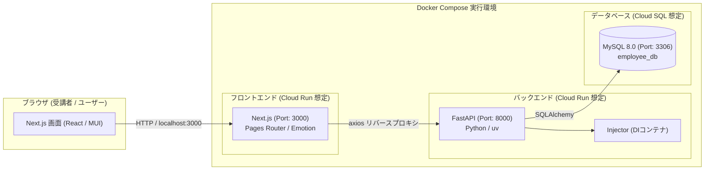
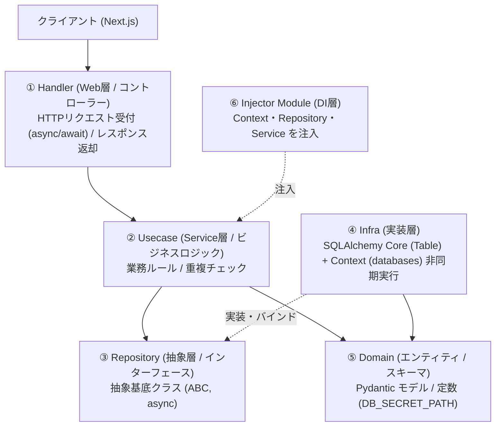

# システム全体アーキテクチャ・設計解説

本システムは、現場の実開発で広く採用されている**クリーンアーキテクチャ（レイヤードアーキテクチャ）**と**コンポーネント指向フロントエンド**を組み合わせた構成になっています。

---

## 1. 全体構成図



---

## 2. バックエンドのクリーンアーキテクチャ（レイヤー構造）

バックエンド（FastAPI）は、責任の分離（SoC）とテスト容易性・保守性を高めるため、以下の6つのレイヤーに分割されています。



### 各ディレクトリの役割

| ディレクトリ | 役割 | 現場での意図 |
| :--- | :--- | :--- |
| `domain/` | 業務データモデル（Pydanticスキーマ）および定数（`constants.DB_SECRET_PATH`）の定義 | SecretManagerのマウント先パスや入出力スキーマ、定数を集約する。 |
| `handler/` | FastAPIのルーター（エンドポイント）定義 | 非同期 `async def` でリクエストを受け取り、Serviceを呼び出してレスポンスを返す。 |
| `usecase/` | ビジネスロジック（`EmployeeService`） | 「メールアドレスが重複していないか」「指定IDの社員が存在するか」などの業務ルールを非同期で検証・処理する。 |
| `repository/` | データアクセスの抽象インターフェース（抽象クラス） | 非同期DB操作の仕様（メソッド一覧）のみを定義する。 |
| `infra/` | Repositoryインターフェースの具象実装 | `sqlalchemy.Table` と `Context.db`（`databases.Database`）を使い、非同期（`await fetch_all / execute`）でSQLを発行・実行する。 |
| `injectormodule/` | 依存性の注入（DI: Dependency Injection）設定 | `injector` ライブラリを使い、`Context` や `EmployeeRepositoryImpl` を自動的に紐付ける。 |
| `utils/` | 共通ログ・コンテキストユーティリティ | `Context`（`db: databases.Database` 保持）やロガーを提供する。 |

---

## 3. なぜ DI（依存性の注入）を使うのか？

バックエンドでは Python の `injector` ライブラリを採用しています。

```python
# injectormodule/di.py
class AppModule(Module):
    def configure(self, binder: Binder) -> None:
        # 抽象インターフェースに対して具象クラスをバインド
        binder.bind(EmployeeRepository, to=EmployeeRepositoryImpl, scope=singleton)
```

### メリット
1. **結合度の低下**: `EmployeeService` は `EmployeeRepository`（抽象）にしか依存していません。MySQLの実装詳細（SQLAlchemy）を知る必要がありません。
2. **単体テストの容易さ**: テスト時には、モック用のInMemoryリポジトリを差し替えるだけで、DBを立ち上げずにServiceのテストを実行できます。

---

## 4. フロントエンドの設計（Next.js + MUI）

フロントエンドは Next.js の **Pages Router** を採用し、Material UI (MUI) と Emotion によるSSR完全対応の構成になっています。

```
frontend/employee-management/
├── pages/
│   ├── _app.tsx              # Emotion CacheProvider と MUI ThemeProvider を包括
│   ├── _document.tsx          # サーバーサイドでEmotionのスタイルタグを抽出・注入
│   ├── index.tsx              # ルートページ
│   ├── EmployeeManagementUi.tsx # 社員管理のメイン画面（ステート管理・API連携）
│   └── components/
│       ├── EmployeeSearchForm.tsx        # 検索条件入力・新規登録ボタン
│       ├── EmployeeTable.tsx             # 一覧テーブル・チェックボックス行内編集・削除ボタン
│       ├── EmployeeCreateModal.tsx       # 新規登録モーダル (React Hook Form + Yup)
│       └── EmployeeDeleteConfirmDialog.tsx # 物理削除確認ダイアログ
├── src/
│   ├── createEmotionCache.ts  # Emotion SSRキャッシュ生成
│   └── theme.js               # MUI カラーテーマ設定
├── types/
│   └── employee.ts            # TypeScript型定義
└── services/
    └── employeeApi.ts         # axios を使ったバックエンドAPI通信関数群
```

### ポイント
- **MUI + Emotion**: GoogleのMaterial Designに基づいた洗練されたUIコンポーネント群を導入。
- **React Hook Form + Yup**: フォームの入力値管理・バリデーションスキーマの分離。
- **axios サービス層**: コンポーネント内に直接 `axios.get` などを散乱させず、`services/employeeApi.ts` にAPI通信を集約。
